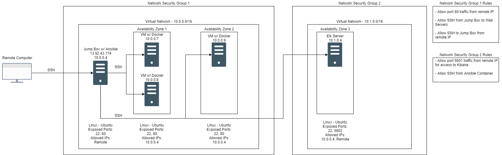

## Automated ELK Stack Deployment

The files in this repository were used to configure the network depicted below.

These files have been tested and used to generate a live ELK deployment on Azure. They can be used to either recreate the entire deployment pictured above. Alternatively, select portions of the playbook file may be used to install only certain pieces of it, such as Filebeat.

  

This document contains the following details:
- Description of the Topologu
- Access Policies
- ELK Configuration
  - Beats in Use
  - Machines Being Monitored
- How to Use the Ansible Build

### Description of the Topology

The main purpose of this network is to expose a load-balanced and monitored instance of DVWA, the D*mn Vulnerable Web Application.

Load balancing ensures that the application will be highly available, in addition to restricting access to the network.
- _TODO: What aspect of security do load balancers protect? What is the advantage of a jump box?_

Integrating an ELK server allows users to easily monitor the vulnerable VMs for changes to the server and system logs.
- _TODO: What does Filebeat watch for?_
- _TODO: What does Metricbeat record?_

The configuration details of each machine may be found below.
_Note: Use the [Markdown Table Generator](http://www.tablesgenerator.com/markdown_tables) to add/remove values from the table_.

| Name       | Function   | IP Adress | Operating System |
|------------|------------|-----------|------------------|
| Jump Box   | Gateway    | 10.0.0.4  | Linux            |
| Web 1      | Web Server | 10.0.0.7  | Linux            |
| Web 2      | Web Server | 10.0.0.8  | Linux            |
| Web 3      | Web Server | 10.0.0.9  | Linux            |
| Elk-Server | Elk Server | 10.1.0.4  | Linux            |

### Access Policies

The machines on the internal network are not exposed to the public Internet. 

Only the Jump Box machine can accept connections from the Internet. Access to this machine is only allowed from the following IP addresses:
- 69.221.219.111

Machines within the network can only be accessed by the Jump Box VM (10.0.0.4).
- _TODO: Which machine did you allow to access your ELK VM? What was its IP address?_

A summary of the access policies in place can be found in the table below.

| Name       | Publicly Accessible | Allowed IP Addresses     |
|------------|---------------------|--------------------------|
| Jump Box   | Yes                 | 69.221.219.111           |
| Web 1      | No                  | 10.0.0.4                 |
| Web 2      | No                  | 10.0.0.4                 |
| Web 3      | No                  | 10.0.0.4                 |
| Elk-Server | Yes                 | 69.221.219.111, 10.0.0.4 |

### Elk Configuration

Ansible was used to automate configuration of the ELK machine. No configuration was performed manually, which is advantageous because...
- The configuration can be easily redoployed on other machines.

The playbook implements the following tasks:
- _TODO: In 3-5 bullets, explain the steps of the ELK installation play. E.g., install Docker; download image; etc._
- Install docker
- Pull specific image of Elk - "sudo docker pull sebp/elk:761"
- Run Elk container - "sudo docker run -p 5601:5601 -p 9200:9200 -p 5044:5044 -it --name elk sebp/elk:761"

The following screenshot displays the result of running `docker ps` after successfully configuring the ELK instance.

### Target Machines & Beats
This ELK server is configured to monitor the following machines:
- 10.0.0.7
- 10.0.0.8
- 10.0.0.9

We have installed the following Beats on these machines:
- Filebeat
- Metricbeat

These Beats allow us to collect the following information from each machine:
- Filebeat collects information from the system logs of each machine and checks for any changes. Metric collects information on system metrics such as CPU and Memory usage.

### Using the Playbook
In order to use the playbook, you will need to have an Ansible control node already configured. Assuming you have such a control node provisioned: 

SSH into the control node and follow the steps below:
- Copy the playbook file (ElkStackPlayBook.yml) to ansible container in /etc/ansible.
- Update the hosts and ansible.cfg files to include IPs in the network and remote user.
- Run the playbook, and navigate to http://(your.VM.IP):5601/app/kibana to check that the installation worked as expected.

_TODO: Answer the following questions to fill in the blanks:_
- _Which file is the playbook? Where do you copy it?_
- _Which file do you update to make Ansible run the playbook on a specific machine? How do I specify which machine to install the ELK server on versus which to install Filebeat on?_
- _Which URL do you navigate to in order to check that the ELK server is running?

_As a **Bonus**, provide the specific commands the user will need to run to download the playbook, update the files, etc._
